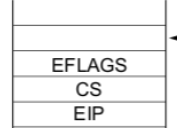

A) La excepcion que se produce cuando se trata de ejecutar una instruccion no soportada es la numero 6, invalid opcode. 

B)  

La pila se va a ver asi con esp apuntando a eip. 

C) La direccion de retorno que se encuentra en la pila es la que apunta a RSTLOOP. Lo que vamos a tener que hacer para que se ejecute la siguiente instruccion es incrementar el eip de la pila en 4 bytes, ya que la instruccion ocupa 4 bytes. 

D) El codigo en `isr.asm` de la atencion de la interrupcion va a ser: 

```asm
global _isr6

_isr6:
	; Estamos en un page fault.
    mov esi, [esp] ; Ahora en esi esta el eip de la tarea
    mov ax, [esi] ; En al esta la primera parte del opcode 
    cmp al, 0x0B0F
    jne .matar_tarea
    ; Si estamos aca es porque se trato de ejecutar RSTLOOP
    ; Para que cuando se vuelva de la tarea se apunte a la siguiente instruccion voy a modificar el valor del eip guardado en la pila
    add esi, 2
    mov [esp], esi
    .matar_tarea: 
    call matar_tarea_actual
    mov ax, [GDT_IDX_TASK_IDLE]
    shl ax, 3
    mov word [sched_task_selector], ax
    jmp far [sched_task_offset] 
```

Y en `sched.c` definimos la funciones: 

```c
void matar_tarea_actual(){
  sched_disable_task(current_task);
}


```
