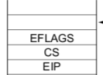

A) Cuando se ejecuta una instruccion no soportada por la isa se produce la excepcion numero 6, undefined opcode.

B) Si se llama a RSTLOOP desde codigo de nivel usuario la pila se va a ver asi:



Con esp igualmente apuntando a EIP.

C) CS y Eip en ambos casos van a estar apuntando a la instruccion que genero la excepcion.

D) Vamos a tener que agregar la rutina de atencion de la interrupcion en isr.asm y comentar el isrne 6. La rutina va a ser: 

```asm
global _isr6
_isr6:
  mov esi, [esp] ; Obtenemos el eip de la intruccion que produjo la excepcion
  mov al, [esi] ; Cargamos en al la instruccion a la que apunta
  cmp al, 0x0F
  jne .fin
  ; Si estamos aca es porque la primera parte de la codificacion esta bien, ahora hay que checkear la segunda
  mov al, [esi + 1] ; Cargamos la segunda parte de la codificacion
  cmp al, 0x0B
  jne .fin
  ; Si estamos aca es porque se llamo a RSTLOOP
  xor ecx, ecx ; Ponemos ecx en 0
  add DWORD [esp], 2 ; Le sumamos dos al eip de la pila para que apunte a la siguiente instruccion
  iret
  .fin:
    ; Si estamos aca es porque no se llamo a RSTLOOP por lo que hay que pausarla y saltar a la idle
    str ax ; Guardamos el tr en ax
    push ax ; Le pasamos el selector como parametro a pause_task
    call pause_task
    add esp 2 ; Desapilamos
    call sched_idle_selector ; Buscamos el selector de la idle en el scheduler y saltamos ahi
    jmp eax ; Saltamos a la idle
```

Y las funciones auxiliares nuevas en sched.c son: 
```c 
uint16_t sched_idle_selector(void){
  return GDT_IDX_TASK_IDLE << 3;
}

void pause_task(uint16_t selector_tarea_a_pausar){
  for (int8_t i = 0; i < MAX_TASKS; i++) {
    if (sched_tasks[i].selector == selector_tarea_a_pausar) {
      sched_tasks[i] = (sched_entry_t) {
        .selector = selector_tarea_a_pausar,
	      .state = TASK_PAUSED,
      };
      return;
    }
  }
}
```
